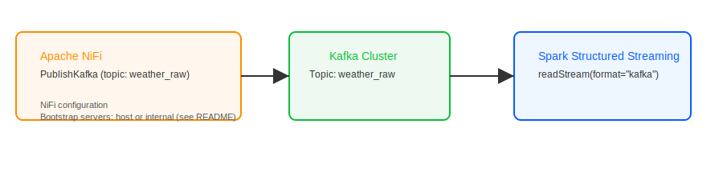

# NiFi Flow — Weather Ingestion & Connection to Spark

I wrote this file to explain the NiFi workflow I used in this project. I also explain how NiFi connects to the Spark job (`spark-apps/process_weather.py`). I kept two diagrams in the repo to make the ideas clear.

## Short overview

I use NiFi to take incoming weather CSV rows and put them into Kafka. Spark reads the rows from Kafka, cleans them, and writes CSV files to `data/clean_weather`.

You can also use NiFi to read the cleaned files later and send them to other systems.

The basic path is: External source → NiFi → Kafka topic `weather_raw` → Spark → `data/clean_weather`.

## Common NiFi processors I use

1) Ingest
- `ListenHTTP`, `ListenTCP`, or `GetFile` — use one of these depending on where your data comes from.

2) Parse (optional)
- `ConvertRecord` or `ExtractText` — use this if you want to validate or route rows before sending to Kafka.

3) Publish to Kafka (main step)
- `PublishKafka` or `PublishKafkaRecord` — I send each CSV row as a string value to topic `weather_raw`.
- Important settings:
  - Bootstrap servers: if NiFi runs on your Windows host use `localhost:9094`. If NiFi runs inside the same Docker network use `kafka:9092`.
  - Topic: `weather_raw`.
  - Serializer: use `StringSerializer` for the value.

4) Archive or route copies (optional)
- I sometimes use `PutFile` to save a copy under `data/raw_ingest` or `UpdateAttribute` to add metadata.

5) Read cleaned files (optional)
- To pick up Spark's cleaned output, use `ListFile` → `FetchFile` on `/data/clean_weather` and then `PutS3Object`, `PutDatabaseRecord`, or `PublishKafka` depending on where you want to send the data next.

## How NiFi and Spark work together (details)

- NiFi publishes CSV rows to the Kafka topic `weather_raw`.
- I run the Spark job inside the Compose network. In `process_weather.py` the code uses `kafka_bootstrap = "kafka:9092"` when Spark runs in the same Docker network.
- Spark uses `spark.readStream.format("kafka")` and reads from `weather_raw`. The job expects each Kafka message value to be a CSV string.

Alternate option:
- Spark writes cleaned CSV files to `/data/clean_weather`. NiFi can watch that folder and pick up those files for more processing.

## A simple example flow I recommend

[ListenHTTP] → [ConvertRecord or RouteOnAttribute] → [PublishKafka]

- `ListenHTTP` receives POSTed CSV rows.
- `ConvertRecord` (optional) validates the CSV.
- `PublishKafka` sends rows to `weather_raw`.

See the diagram: `nifi_flow_diagram.svg`.

## Quick troubleshooting tips

- If NiFi or a host client can’t reach Kafka, check the bootstrap address:
  - From the Windows host use `localhost:9094`.
  - From inside the Compose network (containers) use `kafka:9092`.
- If Spark can’t download Kafka packages, make sure the spark container has internet access.
- If Spark can’t write files, make sure the `data/` folders exist and have correct permissions.

NiFi → Kafka → Spark detail:

## Simple checklist to connect NiFi with this repo

- Start Docker Compose (Zookeeper, Kafka, Spark).
- Create topic `weather_raw` (run `create_topic.bat` or create it from NiFi).
- Configure `PublishKafka` in NiFi to use the correct bootstrap server and topic `weather_raw`.
- Start NiFi ingestion and check messages (or run `consume_topic.bat` to verify).
- Run the Spark job from the `spark-master` container and confirm files arrive in `data/clean_weather`.
- (Optional) Configure NiFi `ListFile` / `FetchFile` on `data/clean_weather` to move cleaned files onward.

If you want, I can also make a NiFi template that you can import, or I can add step-by-step screenshots showing the exact processor settings.

